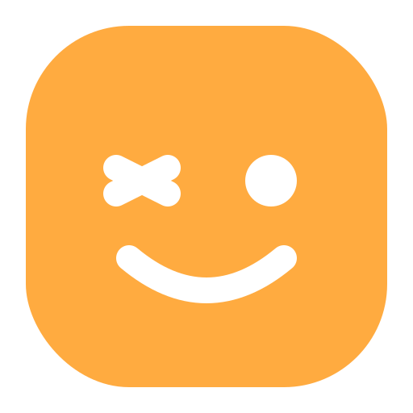
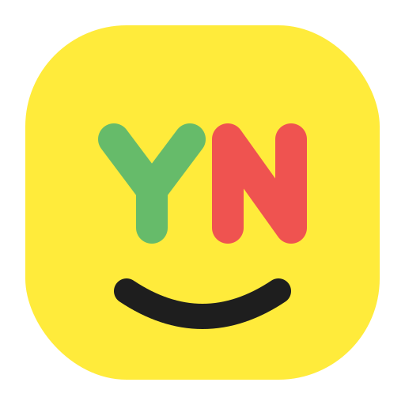

# kaoiro (カオイロ)

**Casual AI Communication Tool**

kaoiroは、AIとの対話を「もっと自然に、もっとカジュアルに」するためのハンズフリー入力支援ツールです。
キーボードやマウスを使わず、あなたの「頷き（YES）」や「首振り（NO）」だけでAIエージェントに応答できます。

開発者にとってはコーディングの手を止めない強力なアシスタントとして。
すべてのユーザーにとっては、AIと感情を通わせる新しいコミュニケーションの扉として。
「顔色」を読み取るテクノロジーが、あなたとAIの距離を縮めます。

---

## Assets (Logo Drafts)
開発におけるアイコン・ロゴデザインのたたき台。

- **Logo A: The Face** (直球)
    
    - 丸みを帯びた四角（スクワークル）の中に、シンプルなラインで描かれた「ウインクする顔」。親しみやすさ重視。
- **Logo B: Communication** (対話)
    
    - 「吹き出し」の形と「顔」を融合させたデザイン。AIとの対話を表現。
- **Logo C: Kaoiro Palette** (抽象)
    
    - 「顔色」という言葉から、感情の変化をグラデーション（ミントグリーン⇔コーラルレッド）で表現したミニマルな円形アイコン。
- **Logo D: YES/NO Accent** (機能強調)
    
    - 目の部分を「Y」と「N」のアルファベットで構成した遊び心のあるデザイン。ツールの主目的であるYES/NO入力をダイレクトに表現。

---

# プロジェクトドキュメント インデックス (README.md)

本プロジェクト「kaoiro」の設計・計画に関するドキュメント一覧。

## 1. プロジェクト概要・計画
| ファイル名 | 説明 | 必読 |
| :--- | :--- | :---: |
| **[rd.md](./rd.md)** | **要件定義書**。機能要件（顔認識、キー入力、拡張機能連携）、非機能要件、ターゲットユーザーを定義。 | ◎ |
| **[plan.md](./plan.md)** | **開発計画書**。フェーズ分け（Phase 1〜4）、マイルストーン、タスクリスト、リスク管理。 | ◎ |
| **[consept.md](./consept.md)** | **コンセプト**。ビジョン「Casual AI Communication」、ターゲット層、コアバリュー。 | ○ |
| **[proposal.md](./proposal.md)** | **提案書**。プロジェクトの背景、解決策、期待される効果、技術的優位性。 | |
| **[benchmarking.md](./benchmarking.md)** | **競合調査**。類似ツールとの比較と、kaoiro独自の強み（ポジショニング）。 | |

## 2. 設計・アーキテクチャ
| ファイル名 | 説明 | 必読 |
| :--- | :--- | :---: |
| **[architecture.md](./architecture.md)** | **アーキテクチャ設計**。システム構成図、コンポーネント分割、データフロー（Native/WASM）。 | ◎ |
| **[tech_issues.md](./tech_issues.md)** | **技術課題**。OpenCVのビルド、Wayland対応、音声認識の多言語化など。 | ○ |
| **[src_structure.md](./src_structure.md)** | **ソースコード構成**。Rustプロジェクトのディレクトリ構造とモジュールの役割。 | ○ |
| **[error_logging.md](./error_logging.md)** | **エラー処理・ログ**。エラーハンドリングの方針、ログレベル、プライバシー配慮。 | |

## 3. UI/UX・デザイン
| ファイル名 | 説明 | 必読 |
| :--- | :--- | :---: |
| **[ux_flows.md](./ux_flows.md)** | **UXフロー**。初回起動、ジェスチャー入力、誤爆防止、設定変更などのユーザーストーリー。 | ◎ |
| **[app_looks.md](./app_looks.md)** | **デザインガイド**。「Friendly & Minimal」テーマ、配色、顔アイコンのアニメーション。 | ○ |
| **[wireframe.md](./wireframe.md)** | **ワイヤーフレーム**。メインウィンドウ、設定パネルの画面構成案。 | |
| **[ui_components.md](./ui_components.md)** | **UIコンポーネント**。egui/WASMで使用する部品（StatusIndicator, WindowSelector等）の定義。 | |

## 4. ネーミングについて
### 名称：kaoiro（カオイロ）
日本語の「顔色（かおいろ）」に由来します。

- **コンセプトへの合致**: 「顔色をうかがう」「顔色を読む」という言葉が持つ「相手の意図を汲み取る」「空気を読む」というニュアンスを、AIと人間の新しいコミュニケーションの形に重ねています。
- **響きと親しみやすさ**: 柔らかい母音の響きは、プロジェクトのテーマである「Friendly & Casual」を象徴しています。
- **ビジョン**: 文字情報だけでなく、顔の動きという非言語情報をAIに伝えることで、より人間らしい自然な対話を実現することを目指しています。

### 他の候補案 (参考)
検討過程で挙がった他の名称案。将来的な機能拡張や別エディションの参考として記録。

- **Kokun (コクン)**: 頷く擬音。カジュアルさと可愛らしさを強調する場合に有力。
- **Unazuki (頷き)**: 機能そのものを表す日本語。
- **Aun (阿吽)**: 「阿吽の呼吸」。より高度な文脈理解を実現した際のコードネーム候補。
- **Mimic (ミミック)**: ユーザーの表情を真似る機能にフォーカスする場合。