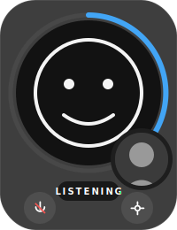
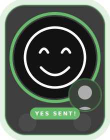
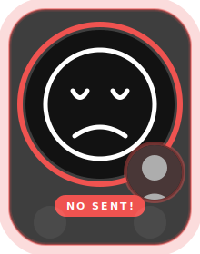
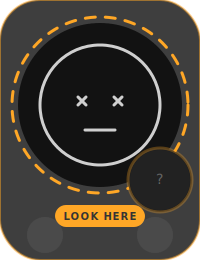
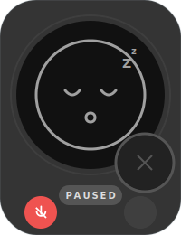
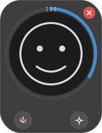
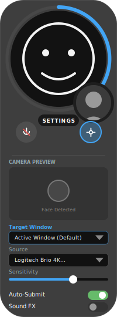

# アプリケーションの外観 (app_looks.md)

## 1. デザインテーマ
**「Gadget & Hero Icon」**
デスクトップに常駐する「頼れる相棒」としての存在感と、感情を伝える「大きな顔アイコン」を主役にしたデザイン。

- **スタイル**: ガジェット・ライク。ゆとりのある余白と、ベースプレート（ガラス板）による浮遊感。
- **質感**: すりガラスのような透過（Backdrop Blur）と、視認性を高める光彩（Glow）エフェクト。
- **ベースカラー**: ダークグレー (#1E1E1E) を 85% 程度の透過で運用。

## 2. メインウィンドウのステート定義

### 2.1. 待機中 (Idle / Listening)

- **概要**: ユーザーを見守り、ジェスチャーを待っている状態。
- **視覚的特徴**:
    - **Hero Icon**: メインエリアいっぱいに広がる線画の顔アイコン。表情は穏やか。
    - **Progress Ring**: 青色 (#42A5F5) で稼働中であることを示す。
    - **PiP (Picture in Picture)**: 右下に小さくカメラ映像（シルエット加工済み）を表示し、認識状況を確認可能。

### 2.2. YES判定 (Action Success)

- **概要**: 肯定的なジェスチャー（頷き）を検知した瞬間。
- **演出**:
    - **Glow**: 全体がミントグリーン (#66BB6A) に強く発光。
    - **Icon**: 満面の笑み（アーチ状の目）に変化。
    - **Label**: 「YES SENT!」と明確にフィードバック。

### 2.3. NO判定 (Rejected)

- **概要**: 否定的なジェスチャー（首振り）を検知した瞬間。
- **演出**:
    - **Glow**: コーラルレッド (#EF5350) に発光。
    - **Icon**: 困ったような表情（への字口、ハの字目）。
    - **Label**: 「NO SENT!」と表示。

### 2.4. 見失った状態 (Lost)

- **概要**: 顔がカメラ範囲外に出た、または遮られた状態。
- **演出**:
    - **Color**: アンバー/イエロー (#FFA726) で注意喚起。
    - **Icon**: 目が「？」になり、ユーザーを探している様子。
    - **Ring**: 破線（Dashed）になり、接続が不安定であることを示唆。

### 2.5. 一時停止 (Paused)

- **概要**: ユーザー操作により機能を停止中。
- **演出**:
    - **Color**: 彩度を落としたグレー (#90A4AE) と、薄暗い背景。
    - **Icon**: 目を閉じて睡眠中（Zzz...）。
    - **Button**: 左下のミュートボタンがアクティブ（赤）になり、停止中であることを強調。

### 2.6. ホバー状態 (Hover State)

- **概要**: ウィンドウ操作を行うためにマウスを重ねた状態。
- **視覚的特徴**:
    - **Overlay Controls**: 右上に「閉じるボタン(X)」、上部中央に「ドラッグハンドル(Grip)」がフェードイン。
    - **Frame Accent**: 背景パネルの境界線が強調され、操作可能であることを示す。
    - **Feedback**: アバターエリアがわずかに暗くなり、コントロールの視認性が向上。

## 3. 設定パネル (Settings)

- **概要**: 詳細設定を行うための展開モード。
- **特徴**:
    - **Base Plate**: 縦に大きく展開し、コントロールを表示。
    - **Privacy Preview**: 生のカメラ映像ではなく、「プライバシーフィルタ適用後」の映像を表示し、安心感を醸成。
    - **Trust Badge**: 最下部に「Local Edge AI」バッジを常時表示。

## 4. インタラクション
- **Window Drag**: ドラッグハンドル、またはボタン以外の背景部分を掴んで、画面上の自由な位置に移動可能。
- **Auto-Hide Controls**: マウスが離れると操作用ボタン（閉じる、ドラッグハンドル）は自動的にフェードアウトし、ミニマルな外観に戻る。
- **PiP Swap**: サブビュー（小）をクリックすると、メインビュー（大）と入れ替わるアニメーション。
- **Button Hover**: 右下の設定ボタンや左下のミュートボタンは、ホバー時に少し拡大・明度アップする。
