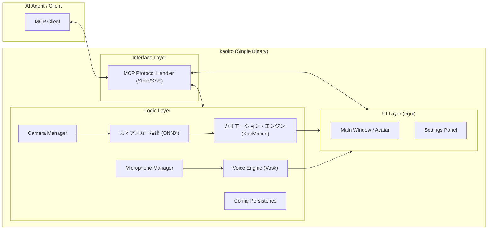
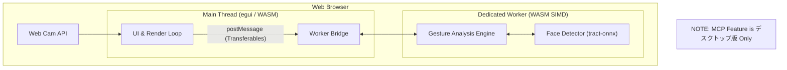

# アーキテクチャ (architecture.md)

`kaoiro` システムの全体構造。MCPサーバーと `egui` アプリケーションの連携、プラットフォームごとの差異、および内部モジュールの責務を定義する。

## 1. システム全体図 (デスクトップ版)

デスクトップ版は **Rust製の単一バイナリ (Single Binary)** として動作し、GUIアプリケーション機能とMCPサーバー機能を併せ持つ。

...

### 3.6. Voice Engine [Phase 3]
- [voice_integration.md](voice_integration.md) に基づく音声認識・コマンド制御。
- **デスクトップ版**: `Vosk` によるオフライン認識。
- **ブラウザ拡張機能版**: `Web Speech API` へのブリッジ。
- **機能**: 音声テキスト変換 (Dictation) と、キーワードによる操作 (Voice Command)。

## 2. システム全体図 (ブラウザ拡張機能版)

ブラウザ拡張機能版はブラウザ上で動作する拡張機能として提供する。
**※MCPサーバー機能はデスクトップ版限定であり、ブラウザ拡張機能版には搭載しない。**

## 3. コンポーネントの責務

### 3.1. GUI Layer (egui)
- [app_looks.md](app_looks.md) に基づく視覚演出（Avatar, Glow, ProgressRing）の実行。
- ユーザーによる設定変更（カメラ選択、感度調整）のUI提供。
- システム状態（Idle/Yes/No/Lost）のリアルタイム反映。
- **Privacy View (PiP)**: 
    - 「認識状況はわかるが、人物は特定できない」加工を施す。
    - **背景**: 生映像をグレースケール化し、強力なぼかし（Gaussian Blur）またはモザイク処理を適用。
    - **前景**: 検出された6点のランドマークを、光るポイントまたは線画（ワイヤーフレーム）としてハッキリと描画。これにより、トラッキング状況のみを視覚化する。

### 3.2. Gesture Analysis Engine
- [gesture_engine.md](gesture_engine.md) に基づくジェスチャー判定。
- Strategyパターンによるアルゴリズム（RelativePosition/ML等）の実行。
- 判定結果の平滑化とデバウンス処理。

### 3.3. MCP Server (Interface)
- **Target**: **デスクトップ版 Only**.
- **Single Binary Integration**: GUIアプリと同一プロセス内で動作。
- AIエージェント（Cline, Gemini等）からの要求受付。
- 判定結果の送信。
- 標準入出力（stdio）または SSE を通じた通信（将来的な拡張）。

### 3.4. Face Detector (ONNX)
- ONNX Runtime または `tract` を用いた高速な顔認識とランドマーク抽出。
- プライバシー保護のための画像処理（シルエット/エッジ抽出）。

### 3.5. Config Manager
- アプリケーション設定の永続化。
- **ファイル形式**: `TOML` 形式.
- **保存場所**: OS標準の config ディレクトリを利用（Linux: `~/.config/kaoiro/`, Windows: `%APPDATA%\kaoiro\`）。
- **保存項目**: `avatar_id`, `sensitivity`, `camera_index`, `privacy_level` (ぼかし強度等)。

## 4. データフロー (デスクトップ版)

1.  **映像取得**: `CamManager` がカメラからフレームを取得。
2.  **顔検出**: `ModelRunner` が顔を検出し、鼻や目の座標（Landmarks）を抽出。
3.  **判定**: `GestureEngine` が時系列ランドマークを解析し、`YES/NO` を確定。
4.  **同期**: 判定結果が内部バスを通じて `UI`（表情変化）と `MCP Interface`（エージェントへの通知）へ送られる。

## 5. プロセス/スレッド構成

- **Main Thread (GUI)**: `egui` の描画ループとユーザー入力。
- **Inference Thread**: ONNX推論とジェスチャー解析（重い処理のオフロード）。
- **Communication Thread**: MCPメッセージの送受信（非同期ランタイム）。

## 6. 通信プロトコル (Internal)
- **Shared State**: `Arc<Mutex<AppState>>` または `Channel` (mpsc) によるモジュール間通信。
- **Event Bus**: 判定確定イベントなどをブロードキャストする仕組み。
