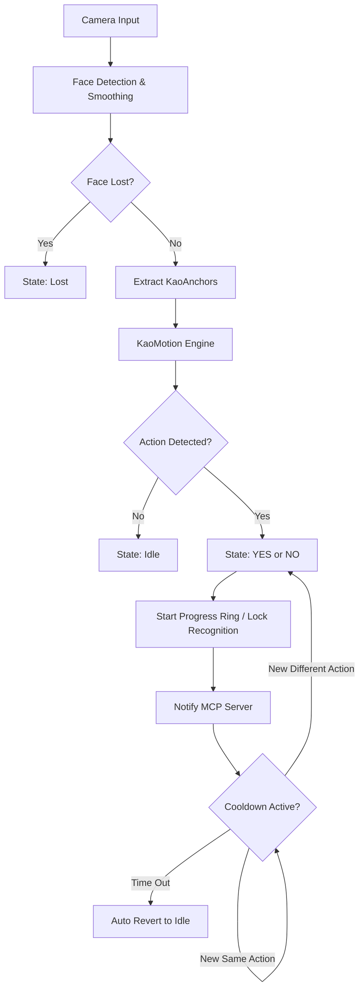

# ユーザー体験フロー (ux_flows.md)

`app_looks.md` で定義された視覚効果と `kaoiro_proto` で得られた知見を統合した、詳細なアクションフロー。
※ジェスチャー判定アルゴリズム（FFTや振幅ベース等）は抽象化して定義する。

## 1. ジェスチャー検知フロー (Detection Flow)

ユーザーがジェスチャーを行い、その結果がAIエージェントに届くまでのプロセス。

## 2. 状態別の詳細UX定義

### 2.1. 待機状態 (Idle)
- **判定**: 顔を検知しているが、大きな動きがない状態。
- **UX**: 
    - アバターが穏やかに瞬き、または微細にアニメーションする。
    - プログレスリングは非表示、または極めて薄く回転（動作中であることを示唆）。
    - 背景は落ち着いたダークグレー（透過）。

### 2.2. YES/NO検知と保持 (Active & Retention)
- **判定**: ジェスチャー確定時、およびその直後の保持期間。
- **UX (YES)**:
    - **演出**: 全体がミントグリーンに発光し、アバターが「笑顔」に変化。
    - **Progress Ring**: 満状態から開始し、保持期間（例: 2.0s）をかけて減少する円環を表示。
    - **ロジック**: 
        - リング表示中は再度「YES」が検知されても無視する。
        - リング表示中に「NO」が検知された場合、即座に演出を NO に切り替え、リングを再スタートする。
- **UX (NO)**:
    - **演出**: 全体がコーラルレッドに発光し、アバターが「困り顔/拒絶」に変化。
    - **Progress Ring**: 満状態から開始し、保持期間をかけて減少。
    - **ロジック**: 
        - リング表示中は再度「NO」が検知されても無視する。
        - リング表示中に「YES」が検知された場合、即座に YES 演出に切り替え、リングを再スタートする。
- **復帰**: リングが消失（0%）した後、スムーズなフェードで `Idle` に戻る。

### 2.4. 見失い状態 (Lost)
- **判定**: 顔検出モデルが確信度を持って顔を特定できない場合。
- **UX**:
    - **演出**: 全体がアンバーに変化し、アバターの目が「？」になる。
    - **ガイド**: PiP（カメラ映像）の枠が強調され、ユーザーに位置調整を促す。

### 2.5. 一時停止 (Paused)
- **判定**: ユーザーによる「Mute」ボタンのクリック。
- **UX**:
    - **演出**: 彩度を落としたモノクロ調の画面。アバターは「睡眠」状態（Zzz...）。
    - **安全**: この状態ではカメラ入力および判定処理を完全にサスペンドし、プライバシーとリソースを保護。

## 3. インタラクション詳細

### 3.1. マウスホバー (Hover Behavior)
- **トリガー**: ウィンドウ領域へのマウス侵入。
- **挙動**:
    - `0.2s` で操作用ボタン（Settings, Mute, Close, DragGrip）がフェードイン。
    - 背景の不透明度がわずかに上がり、ボタンの視認性を確保。

### 3.2. 感度調整 (Sensitivity Adjustment)
- **トリガー**: 設定パネル内スライダーの操作。
- **挙動**:
    - スライダー操作に合わせて、解析エンジンの閾値（Threshold）がリアルタイムに変動。
    - 感度を上げた際、微細なノイズによる誤発火を抑制する平滑化フィルタ（EMA等）の調整。

### 3.3. アバター変更
- **トリガー**: 設定パネル内ギャラリーでの選択。
- **挙動**:
    - 選択した瞬間にアバターがクロスフェードで切り替わる。
    - 選択状態はローカルの設定ファイル（config.toml）に即時保存。
