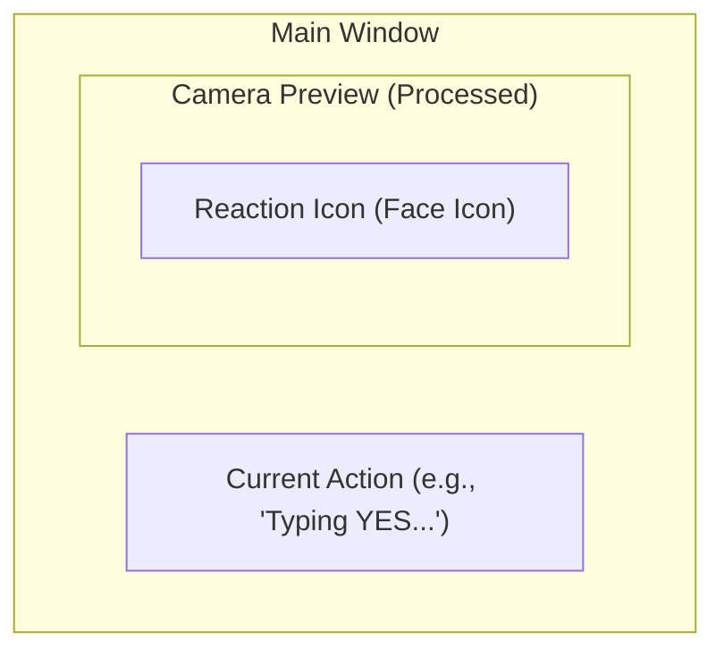
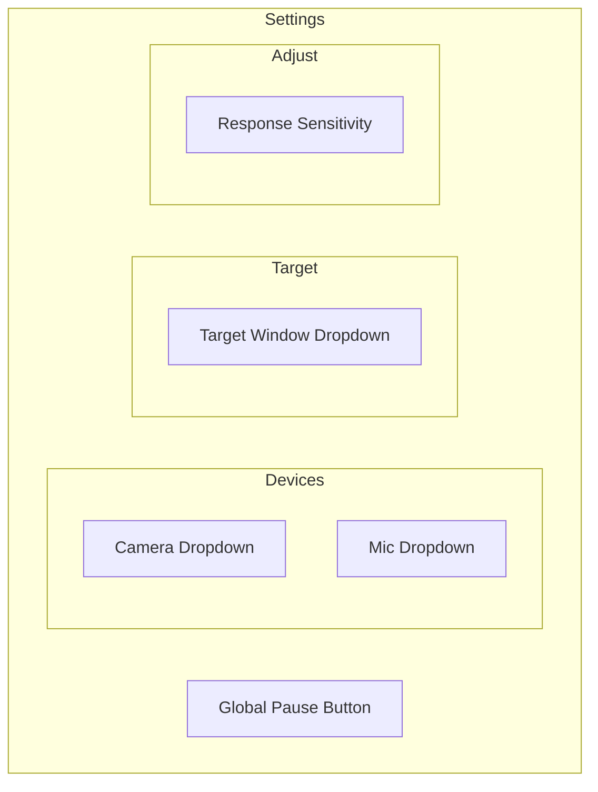

# ワイヤーフレーム (wireframe.md)

## 1. メインウィンドウ (通常時)
親しみやすさを重視した、ミニマルな構成。

- **PreviewArea**: プライバシー加工済みのカメラ映像。
- **IconOverlay**: 判定状態に応じた大きな顔アイコン（👍, 🙅‍♂️, ☺ 等）。
- **StatusText**: 実行中のアクションをテキストで補助表示。

## 2. 設定パネル (展開時)
カメラ選択やウィンドウ選択などを直感的に配置。

## 3. 状態遷移表示
顔アイコンと色による視覚的フィードバック。

| State | Face Icon | Theme Color | Meaning |
| :--- | :--- | :--- | :--- |
| **Idle** | ☺ (Wait) | Blue/Gray | 待機中（穏やかな顔） |
| **YES** | 😄 (Yes!) | Mint Green | 肯定（笑顔・頷き） |
| **NO** | 😟 (No...) | Coral Red | 否定（困り顔・首振り） |
| **Paused** | 💤 (Sleep) | Gray | 一時停止中 |