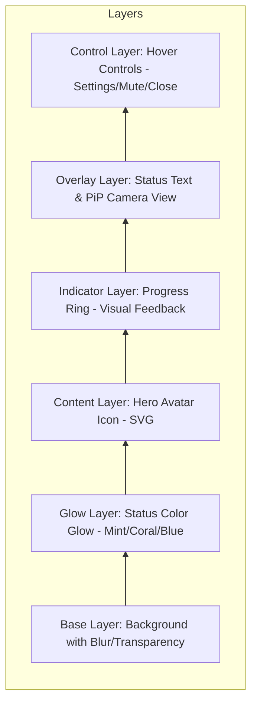
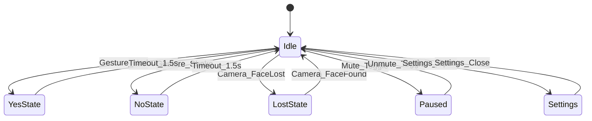

# ワイヤーフレーム (wireframe.md)

## 1. メインウィンドウ構成 (Main Window)
`egui` の `CentralPanel` をベースとした、レイヤー構造のデザイン。



### 1.1. 通常表示 (Idle / Active)
ウィンドウ中央に大きくアバターを表示。背景の光彩（Glow）とアバターの表情で状態を直感的に伝える。

```
+--------------------------------------------------+
| [Drag Grip]                                   [X]| <- Hover Only
|                                                  |
|                                                  |
|          (        Avatar        )                | <- Center Piece
|          (      Smile / Idle    )                |
|                                                  |
|                                                  |
|               [ Status Text ]                    |
|             "YES SENT!" (Fade Out)               |
|                                     [ PiP ]      | <- 1/4 size
| [Settings] [Mute]                   [Camera]     |
+--------------------------------------------------+
   (Glow Effect: Mint Green for YES, Coral for NO)
```

- **Avatar**: ウィンドウの中心。ステートに応じて `avatar_set_*.svg` を切り替え。
- **PiP (Picture in Picture)**: カメラ映像。プライバシー保護のため、エッジ検出やシルエット加工を施して表示。
- **Glow Effect**: `egui` の `PaintCallback` や `Mesh` を用いて、ウィンドウ背後にぼかした色面を描画。

## 2. 設定パネル構成 (Settings Modal)
`egui::Window` または `egui::Area` を用いて、メイン画面上にオーバーレイまたは横に展開。

```
+--------------------------------------------------+
| Settings                                      [X]|
+--------------------------------------------------+
| [ Camera Preview (Larger / Silhouette)         ] |
+--------------------------------------------------+
| [ Device Selection ]                             |
| Camera: [ Default Camera       v ]               |
|                                                  |
| [ Detection Settings ]                           |
| Sensitivity: [-------|-------] (Slider)          |
| Strategy:    (o) FFT  ( ) Simple                 |
|                                                  |
| [ Avatar Selection ]                             |
| (o) Face  ( ) Dog  ( ) Cat  ( ) Flower  ( ) Ghost|
+--------------------------------------------------+
| [ Trust Badge: Local Edge AI Processing ]        |
+--------------------------------------------------+
```

## 3. 画面遷移フロー
状態遷移は `app_looks.md` の定義に準拠。


